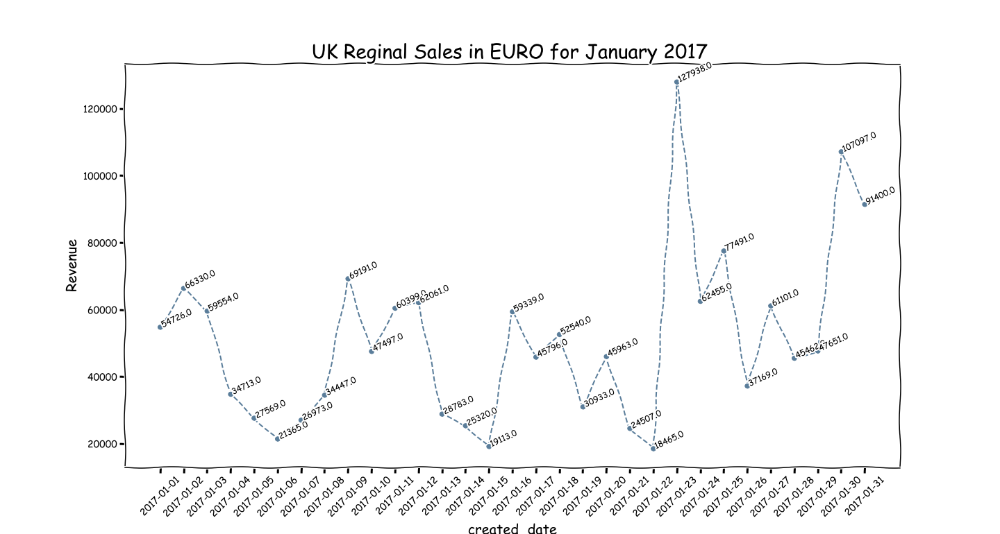
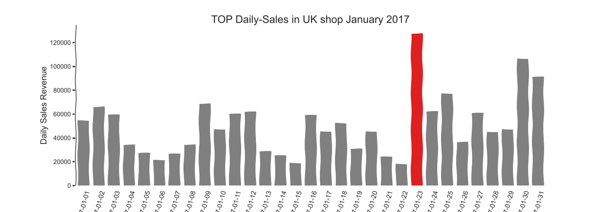
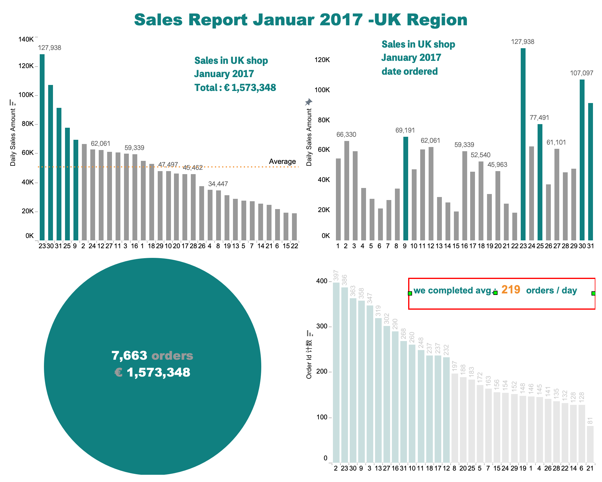
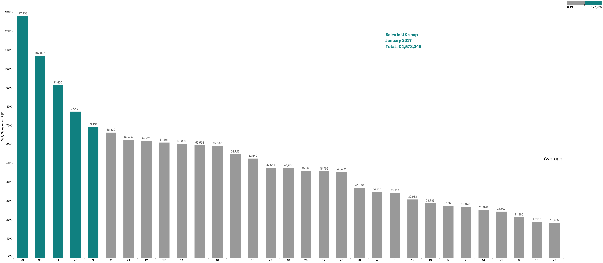
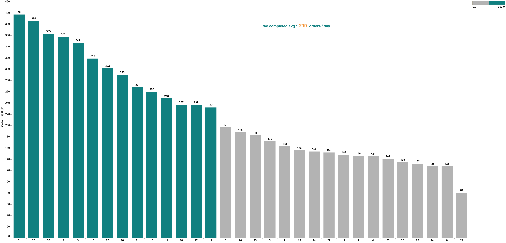
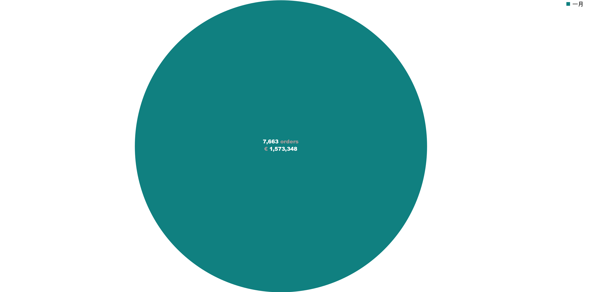

# 
  Data Visulization for Int'l company : Using API to get Foreign Exchange

  
This is an exercise in data visualisation and analysis of reports. It was inspired by a question posed by the interviewer: What do you need to look for when you make a report for the shareholders of an international company? My answer was certainly not the answer the interviewer was expecting and I don't remember what I said. Anyway, the point was that we needed to give the shareholders a uniform currency report. That is, he needed to know how many euros his company's total worldwide sales were in?

So, any other Eurozone sales, we need to use the API to get the historical Euro foreign exchange rate. We then convert all foreign sales into Euros at the prevailing foreign exchange rate accordingly for reporting purposes. This will allow shareholders to make decisions and understand the company's operating performance.

visualization made with Tableau: Dashboard 

It looks like at the end of the month, the sales boosts up. 

.png)

We can see, in the UK shop, they proceed everyday averagely 200 orders. 
And remember these are the completed orders. They are open orders excluded in this report.
The sales reports for all orders typees(open, completed,cancelled , paused.etc will come later)

Ths is the big numbers the stateholders want to know at all of the first. Agree with me?  : ) 

