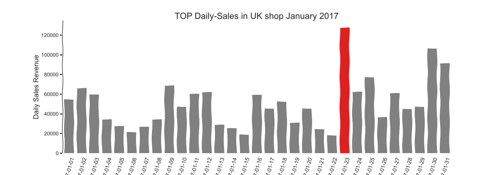
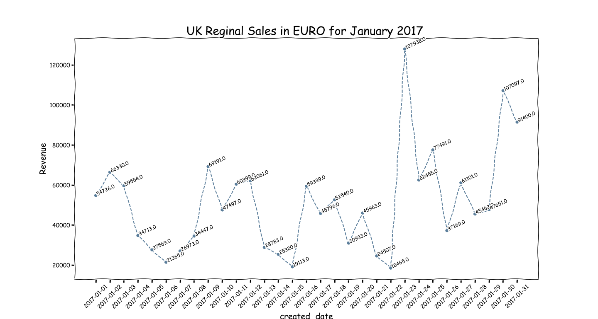

# 
 Using API to request historical daily currency exchange to make unified sales reports for international companies. 

  
When doing data analysis, it is normal to work with historical data. Therefore, historical months, including specific dates, need to be converted into a single currency for each country, so that shareholders can analyse how much the company has sold overall. Compare sales by region. This makes it easier for shareholders to analyse the overall sales of the company.

This is done by using the API to find the currency exchange rates for each day in the past and then multiplying them by the amount of sales in the foreign region using the uniform currency of the report, e.g. euro. The result is that all sales in the report are in the same currency.

